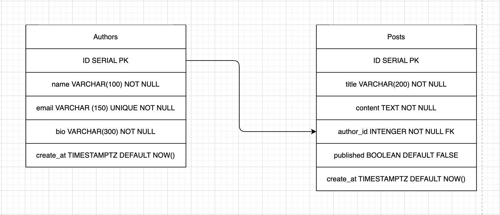

# ProyectoM2_CandelariaFerrari

# 📒 API MiniBlog — DevSpark
---

## 📋 Descripción

MiniBlog es una API REST desarrollada para **DevSpark**, una startup que busca construir una plataforma de contenidos simple y escalable.

La API permite gestionar autores y publicaciones mediante operaciones CRUD completas, utilizando Node.js, Express y PostgreSQL. Además, cuenta con documentación OpenAPI y pruebas automatizadas.

Proyecto integrador del módulo 02 — Soy Henry.

---
## 📊 Diagrama Entidad-Relación (ERD)

La base de datos fue diseñada utilizando PostgreSQL y está compuesta por dos entidades principales:

- **Authors**: almacena la información de los autores.
- **Posts**: almacena las publicaciones creadas por cada autor.

La relación entre ambas tablas es **uno a muchos (1:N)**, donde un autor puede tener múltiples publicaciones y cada publicación pertenece a un único autor.



---
## ✨ Funcionalidades

### Gestión de autores
- ✅ Crear autores.
- ✅ Obtener todos los autores.
- ✅ Obtener un autor por ID.
- ✅ Actualizar autores existentes.
- ✅ Eliminar autores.

### Gestión de posts
- ✅ Crear publicaciones.
- ✅ Obtener todas las publicaciones.
- ✅ Obtener una publicación por ID.
- ✅ Obtener publicaciones de un autor específico.
- ✅ Actualizar publicaciones.
- ✅ Eliminar publicaciones.

### Validaciones implementadas
- Authors:
    - Nombre obligatorio.
    - Email obligatorio.
    - Email único.
    - Bio obligatoria.
- Posts: 
    - Title obligatorio.
    - Content obligatorio.
    - Author_id obligatorio.
    - Author_id debe ser numérico.
    - Published obligatorio.
    - Published debe ser booleano.

### Respuestas HTTP:
    - 200 OK
    - 201 Created
    - 400 Bad Request
    - 404 Not Found
    - 409 Conflict
    - 500 Internal Server Error

### Endpoints

| Método | Ruta                      | Descripción        |
| ------ | ------------------------- | ------------------ |
| GET    | `/authors`                | Listar authors     |
| GET    | `/authors/:id`            | Obtener author     |
| POST   | `/authors`                | Crear author       |
| PUT    | `/authors/:id`            | Actualizar author  |
| DELETE | `/authors/:id`            | Eliminar author    |
| GET    | `/posts`                  | Listar posts       |
| GET    | `/posts/:id`              | Obtener post       |
| POST   | `/posts`                  | Crear post         |
| PUT    | `/posts/:id`              | Actualizar post    |
| DELETE | `/posts/:id`              | Eliminar post      |
| GET    | `/posts/author/:authorId` | Posts de un author |

---

## 🖥️ Manual de usuario
Una vez iniciada la aplicación, los endpoints pueden consumirse desde cualquier cliente HTTP como:

- Postman
- Insomnia
- Thunder Client (Utilizada en este proyecto)

### ¿Como crear un autor?
POST /api/authors
```markdown
{
  "name": "Candelaria Ferrari",
  "email": "candelaria@example.com",
  "bio": "Frontend Developer experta en React"
}
```
### ¿Como crear un post?
POST /api/posts
```markdown
{
  "title": "Mi primer post",
  "content": "Contenido del post",
  "author_id": 1,
  "published": true
}
```
### La documentación completa se encuentra disponible mediante Swagger/OpenAPI.

---
## 🚀 Cómo ejecutar el proyecto en local

```bash
# 1. Cloná el repositorio
git clone https://github.com/candelariaferrari/ProyectoM2_CandelariaFerrari.git

# 2. Ingresar al proyecto
cd ProyectoM2_CandelariaFerrari

# 3. Instalar dependencias
npm install

# 4. Crear archivo .env
Tomar como referencia el archivo .env.example.

PORT=your_port
DB_PORT=5432
DB_HOST=localhost
DB_NAME=name_database
DB_USER=your_user
DB_PASSWORD=your_password

# 5. Crear la base de datos
- Ejecutar los scripts: 
psql -U tu_usuario -d tu_base_de_datos -f sql/setup.sql
psql -U tu_usuario -d tu_base_de_datos -f sql/seed.sql

# 6. Iniciar servidor
npm start
o
npm run dev


# 7. Acceder a la documentación
http://localhost:3000/api-docs

```
----

## 🛠️ Decisiones técnicas
### Arquitectura en capas

El proyecto fue organizado siguiendo una estructura de responsabilidades separadas:

    - Routes: definición de endpoints.
    - Controllers: manejo de requests y responses.
    - Services: acceso a datos y lógica de negocio.
    - Validators: validaciones de entrada.
    - Database: conexión a PostgreSQL.


### PostgreSQL
Se utilizó PostgreSQL como base de datos relacional debido a:

   - Soporte de relaciones mediante Foreign Keys.
   - Integridad de datos.
   - Escalabilidad.
   - Compatibilidad con Node.js mediante la librería pg.

### Validaciones

Las validaciones se implementaron mediante middlewares para mantener los controladores limpios y reutilizables.

---

### 📄 Documentación OpenAPI:**
La documentación fue desarrollada utilizando OpenAPI 3.0 para facilitar la exploración y prueba de endpoints.
La API incluye documentación interactiva generada con Swagger/OpenAPI.

Disponible en:

http://localhost:3000/api-docs

Desde allí es posible:

    - Consultar todos los endpoints.
    - Ver parámetros requeridos.
    - Visualizar ejemplos de requests y responses.
    - Ejecutar pruebas directamente desde el navegador.


## 🧪 Tests
El proyecto incluye pruebas automatizadas utilizando:
    - Jest
    - Supertest

```markdown
# Ejecutar
    npm test

```
---
## 🚀 Deploy en Railway

La API está desplegada en Railway.

- [URL base](https://proyectom2candelariaferrari-production.up.railway.app/api)
- [Authors](https://proyectom2candelariaferrari-production.up.railway.app/api/authors)
- [Posts](https://proyectom2candelariaferrari-production.up.railway.app/api/posts)
- [Documentación](https://proyectom2candelariaferrari-production.up.railway.app/api-docs)

### Variables de entorno en Railway
- `DB_HOST`
- `DB_PORT`
- `DB_NAME`
- `DB_USER`
- `DB_PASSWORD`
- `DATABASE_URL`

### Guía de deploy en Railway

1. Crear cuenta en [Railway](https://railway.app)
2. Crear nuevo proyecto y agregar servicio **PostgreSQL**
3. Conectar el repositorio de GitHub
4. Agregar las variables de entorno en el servicio de Node.js
5. Ejecutar los scripts SQL desde la consola de Railway
6. Railway despliega automáticamente con cada push a main

---

###  🧰 Tech Stack
- Node.js
- Express.js
- PostgreSQL
- pg
- Jest
- Supertest
- Swagger UI
- OpenAPI 3.0


---
## 🗂️ Estructura del proyecto

```
📁 proyecto-m2/
├── 📁 docs
    └── 📄 openAPI.yaml
    └── 📄 documentacion-ia.md
├── 📁 sql/
│   └── 📄 seed.sql
    └── 📄 setup.sql
├── 📁 src/
│   └── 📁 assets/
|       └── 📄 miniblog.drawio.png
|   └── 📁 controllers/
|   |   └── 📄 authors-controller.js
    |   └── 📄 post-controller.js
|   └── 📁 database/
|   |   └── 📄 database.js
|   └── 📁 middlewares/
|   |   └── 📄 errorHandler.js
|   └── 📁 routes/
|   |   └── 📄 authors-route.js
    |   └── 📄 post-route.js
|   └── 📁 services/
|   |   └── 📄 authors-service.js
    |   └── 📄 post-service.js
|   └── 📁 validators/
|   |   └── 📄 authors-validator.js
    |   └── 📄 id-validator.js
    |   └── 📄 post-validator.js
|   └── 📄 index.js
|   └── 📄 server.js    
└── 📁 test/
    └── 📄 authors.test.js
    └── 📄 posts.test.js
└── 📄 .env.example
└── 📄 package-lock.json
└── 📄 package.json
└── 📄 README.md
```

---

## 👩‍💻 Autora

**Candelaria Ferrari** — [@candeferrari](https://github.com/candeferrari)

Proyecto final 02 — Soy Henry